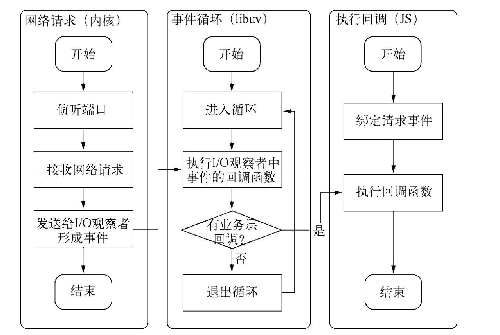

### 异步 IO 的重要性

- 用户的体验:一个资源耗时 M 秒,一个资源耗时 N 秒,同步获取资源耗时 M+N,异步获取耗时 max(M,N)
- 资源分配层面:
  单线程同步编程会因阻塞 IO 导致硬件资源,多线程编程会出现死锁,状态同步等问题
  node 利用单线程远离死锁,状态同步等问题,利用异步 IO 远离阻塞,更好的利用 CPU,为了弥补单线程无法利用多核 cpu 的缺点,可以使用 web works 子进程

### 异步 I/O 的实现

- epoll 方案,进入轮循的时候如果没有检查到 I/O 事件,会进行休眠,直到事件将它唤醒,真实的利用了事件通知,执行回调的方式.

### 事件循环

- 进程启动的时,node 会创建类似于 while(true)的循环,每执行一次循环可以称为 Tick,每个 Tick 的过程就是查看是否有事件待处理,如果有就取出事件及其相关的回调函数,如果存在关联的回调函数,就执行他们,然后进入下一个循环,如果不在有事件处理,就推出进程.

### 观察者

- 在 Tick 的过程中判断是否有事件需要处理,事件循环是一个典型的生产者/消费者模型.异步 IO 和网络请求是事件的生产者,这些事件传递到对应的观察者那,事件循环再从观察者那取到事件并处理

### 请求对象

- 从 JavaScript 发起调用,到内核执行完 I/O 操作的过程中,存在一种中间产物,叫请求对象
  js 调用了 node 的核心模块.核心模块调用了 c++的内建模块,内建模块根据 libuv 进行系统调用,实质上就是调用了 uv_fs_open()方法,调用过程中创建了 FSReqWrap 的请求对象.从 js 传入的参数以及回调都封装在这个请求中.对象包装完毕之后放入到线程池中等待,至此 js 调用立即返回,由 js 层面发起的异步调用第一阶段就此结束.

### 执行回调

- 请求对象放入到线程池完成了异步 IO 的第一部分,回调通知是第二部分,IO 操作调用完成之后,将获取到的结果存储在 req-》result 上,然后通知 IOCP 告知当前的对象已经完成.并将线程规范线程池.这个时候事件循环的观察者可以检查是否有执行完的请求,取出请求对象的 result 属性作为参数,取出 oncomplete_sym 作为方法调用执行.

### 异步 I/O 总结

事件循环、观察者、请求对象、I/O 线程池构成了异步 I/O 的基本要素

### 非 I/O 的异步方法

- setTimeout 和 setInterval 定时器
- process.nextTick 操作较为轻量级
- setImmediate()

### 事件驱动的高性能服务器

