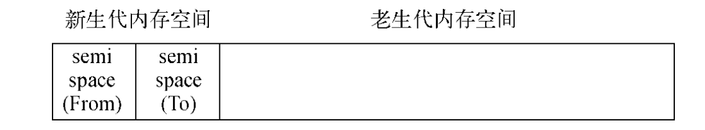

### V8 的垃圾回收机制

###### V8 的内存限制

- node 通过 js 使用内存的时候只能使用部分的内存,64 位系统下为 1.4g,32 系统约 0.7g,导致无法直接操作大内存的对象.产生原因是因为 V8 做一次小的垃圾回收需要 50ms,做一次增量式的需要 1s 以上,所以 V8 在设计的时候限制了堆内存.

###### 分代式垃圾回收机制

- V8 中内存主要有新生代和老生代组成
- 新生代内存由两个 reserved_semispace_size 组成,在 64 位和 32 位分别为 16m 和 8m,所以新生代内存为 32m 和 16m
- 分代的基础上,新生代通过 Scavenge 算法进行垃圾回收,它将内存一分为二,一个处在使用中的叫做 from,闲置状态的空间是 to,分配状态的时候,先在 from 里面进行分配,垃圾回收时,检查 from 空间的存活对象,这些存活对象呗复制到 to 空间,非存活对象释放内存.缺点:只能使用堆内存中的一半.牺牲空间换时间.
- 一个对象经过多次复制依然存在的话会分配到老生代,条件主要有两个:
  1. 是否经历过 Scavenge 回收
  2. to 空间的内存占用是否超过 25%
- 老生代采用标记清除算法,标记存活的对象,清除没有标记的对象,但是会导致内存的不连续.结合标记整理算法,将活着的对象往一端移动,直接清理掉另一端死亡的对象.
  

###### 处理大内存应用

- 因为 v8 的限制,我们无法通过 `fs.write()` 来进行大文件读取.但是可以使用 node 的 stream 模块来进行,`fs.createReadStream`通过流的方式进行操作.
