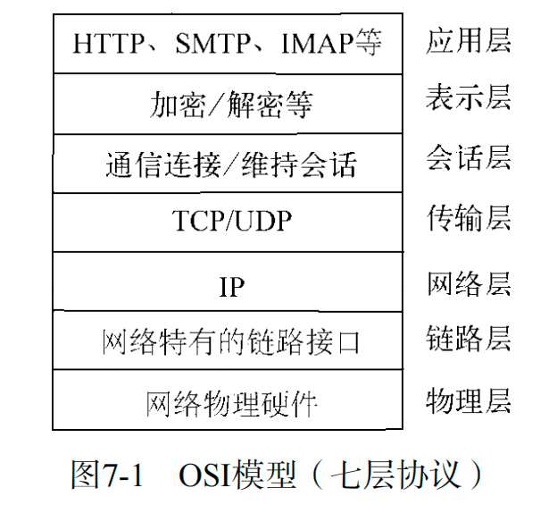
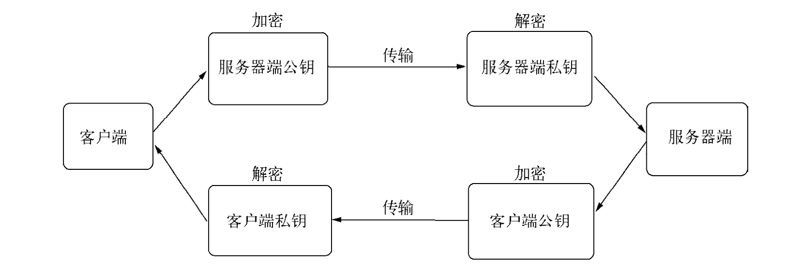

###### TCP

- 传输控制层协议,在 OSI 中分为物理层,数据链路层,网络层,传输层,会话层,表示层,应用层
- 面向连接的协议,传输之前需要进行三次握手形成会话

```js
let net = require('net')
let server = net.createServer(function (socket) {
  socket.on('data', function () {})
  socket.on('end', function () {})
  socket.write('welcome')
})

server.listen(8124, function () {})
```

对于 net.createServer 创建的服务器有以下几个自定义事件

- listen
- connection
- close
- error



### HTTP

```js
//构建http服务器
let http = reuqire('http')
http.createServer(function (req, res) {
  res.end('hello world')
})
```

- 超文本传输协议,构建在 tcp 之上,是应用层协议,http 的两端是服务器和浏览器
- 基于请求进行响应
- 现在的应用如浏览器,是 http 的代理.用户的行为会通过它转换成 http 报文发送给服务器,服务器处理请求之后,发送响应报文给代理,代理解析报文.

```
//http 报文
$ curl -v http://127.0.0.1:1337
* About to connect() to 127.0.0.1 port 1337 (#0)
* Trying 127.0.0.1...
* connected
* Connected to 127.0.0.1 (127.0.0.1) port 1337 (#0)  //三次握手
> GET / HTTP/1.1
> User-Agent: curl/7.24.0 (x86_64-apple-darwin12.0) libcurl/7.24.0 OpenSSL/0.9.8r zlib/1.2.5
> Host: 127.0.0.1:1337
> Accept: */*                      // 握手之后,客户端发送消息
>
< HTTP/1.1 200 OK
< Content-Type: text/plain
< Date: Sat, 06 Apr 2013 08:01:44 GMT
< Connection: keep-alive
< Transfer-Encoding: chunked      //服务器收到消息,发送响应内容
```

###### HTTP 请求

```
> GET / HTTP/1.1  //请求方法 + 请求地址 + http的版本
> User-Agent: curl/7.24.0 (x86_64-apple-darwin12.0) libcurl/7.24.0 OpenSSL/0.9.8r zlib/1.2.5   //key:value格式的请求头
> Host: 127.0.0.1:1337
> Accept: */*
```

###### HTTP 响应

- http 响应对象,可以看成一个可写的流对象,setHeader 和 writeHeader 修改响应报文的头部信息
- 报文体使用 res.write 和 res.end 来修改

###### HTTP 事件

- connection
- request
- close
- checkContinue
- connect
- upgrade //升级协议的时候触发,如升级成 websocket
- clientError

### WebSocket

和 http 比的优势

- 客户端和服务端只需要建立一个 tcp 连接
- 服务器可以主动推送数据到客户端
- 协议头更加轻量级,减少数量传输

```js
//在客户端创建websocket
let socket = new WebSocket(path)
socket.onopen = () => {
  socket.send()
}
socket.onmessage = () => {
  //todo
}
```

```
GET /chat HTTP/1.1
Host: server.example.com
Upgrade: websocket    //与http的区别
Connection: Upgrade   //与http的区别
Sec-WebSocket-Key: dGhlIHNhbXBsZSBub25jZQ==
Sec-WebSocket-Protocol: chat, superchat
Sec-WebSocket-Version: 13
```

websocket 数据帧的定义

- fin 如果这个数据帧是最后一帧,则为 1,其余为 0
- rsv1,rsv2,rsv3,各一位长用于扩展
- opcode,长四位的操作码,
- masked 掩码标识
- payload length 数据长度
- mask Key 掩码
- payload data 数据

### TLS/SSL

TLS 和 SSL 是一个公钥和私钥的结构,是一个非对称的结构,每个服务器端和客户端都有自己的公私钥,公钥用来加密传输的数据,私钥用来解密.



公钥和私钥可能存在窃听的情况,典型的例子就是中间人攻击,为了解决这个问题,TLS/SSL 引入了数字证书来进行认证.
