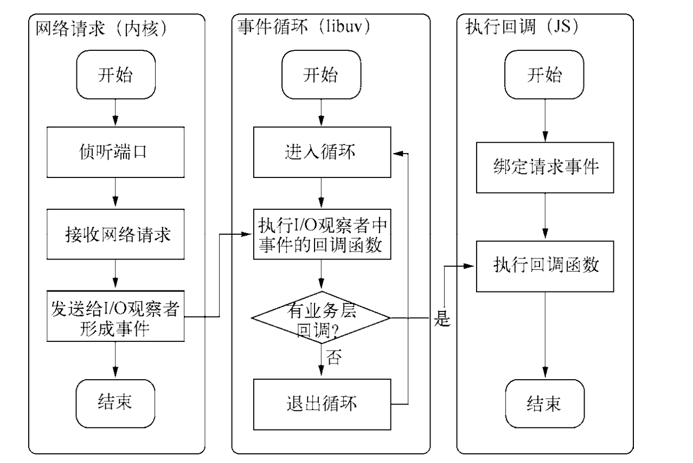

### 异步 IO 的重要性

```
1.用户的体验:一个资源耗时M秒,一个资源耗时N秒,同步获取资源耗时M+N,异步获取耗时max(M,N)
2.资源分配层面:
  单线程同步编程会因阻塞IO导致硬件资源,多线程编程会出现死锁,状态同步等问题
  node利用单线程远离死锁,状态同步等问题,利用异步IO远离阻塞,更好的利用CPU,为了弥补单线程无法利用多核cpu的缺点,可以使用web works子进程
```

### 异步 I/O 的实现

```
epoll方案,进入轮循的时候如果没有检查到I/O事件,会进行休眠,直到事件将它唤醒,真实的利用了事件通知,执行回调的方式.
```

### 事件循环

```
  进程启动的时,node会创建类似于while(true)的循环,每执行一次循环可以称为Tick,每个Tick的过程就是查看是否有事件待处理,如果有就取出事件及其相关的回调函数,如果存在关联的回调函数,就执行他们,然后进入下一个循环,如果不在有事件处理,就推出进程.
```

### 观察者

```
  在Tick的过程中判断是否有事件需要处理,事件循环是一个典型的生产者/消费者模型.异步IO和网络请求是事件的生产者,这些事件传递到对应的观察者那,事件循环再从观察者那取到事件并处理
```

### 请求对象

```
从JavaScript发起调用,到内核执行完I/O操作的过程中,存在一种中间产物,叫请求对象
js调用了node的核心模块.核心模块调用了c++的内建模块,内建模块根据libuv进行系统调用,实质上就是调用了uv_fs_open()方法,调用过程中创建了FSReqWrap的请求对象.从js传入的参数以及回调都封装在这个请求中.对象包装完毕之后放入到线程池中等待,至此js调用立即返回,由js层面发起的异步调用第一阶段就此结束.
```

### 执行回调

```
请求对象放入到线程池完成了异步IO的第一部分,回调通知是第二部分,IO操作调用完成之后,将获取到的结果存储在req-》result上,然后通知IOCP告知当前的对象已经完成.并将线程规范线程池.这个时候事件循环的观察者可以检查是否有执行完的请求,取出请求对象的result属性作为参数,取出oncomplete_sym作为方法调用执行.
```

### 异步 I/O 总结

事件循环、观察者、请求对象、I/O 线程池构成了异步 I/O 的基本要素

### 非 I/O 的异步方法

```
1.setTimeout和setInterval定时器
2.process.nextTick  操作较为轻量级
3.setImmediate()
```

### 事件驱动的高性能服务器


